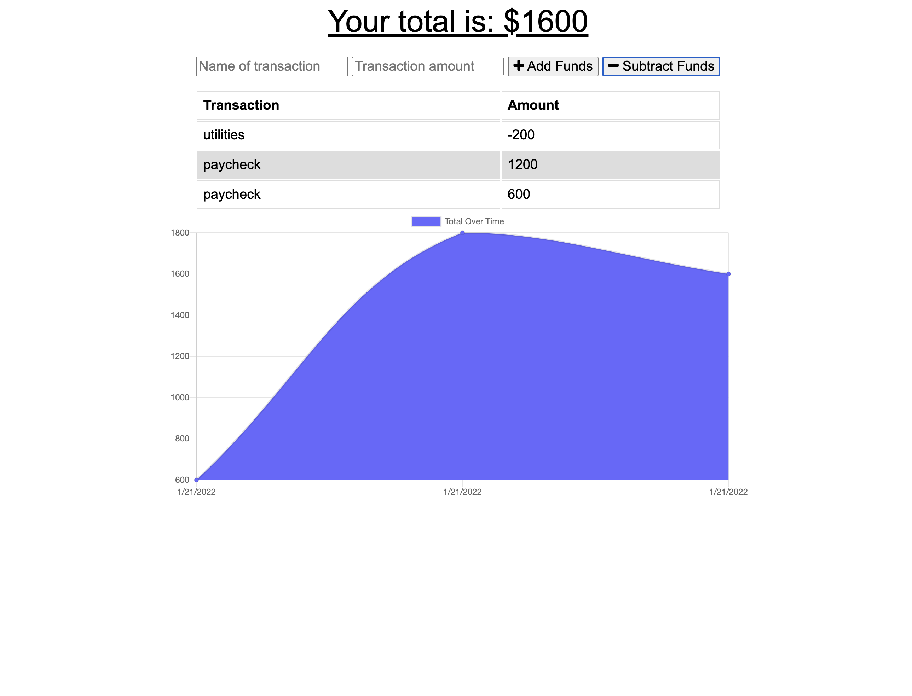

# PWA Budget Tracker

  
  
  ## Table of Contents
  -[Project Description](#projectDescription)
  -[Table of Contents](#tableofContents)
  -[Usage](#usage)
  -[License](#license)
  -[Questions](#questions)

  ## Project Description 
  This is a budget tracker that I converted into a PWA for coding bootcamp with the University of Utah. It is deployed to heroku and connected to a MongoDB database. It has offline functionality and utilizes a service worker. 

  https://hidden-forest-93792.herokuapp.com/
  
  
  
  ## Languages Used 
  Javascript,CSS,HTML,Node,Other

 
 ### What will the app be used for? 
  This application can be used to track budget and spending online or offline. 

  ### How can you contribute?
  Fork a copy of the repo and have fun!

  ### License
  This application is covered under the Open license
  

  ### Questions
  -------------------------------------------------------------------------------------------------------
  
  Check me out on Github!: (https://github.com/Jillium) 
  
  Any questions? Email at holmesjillanne@gmail.com